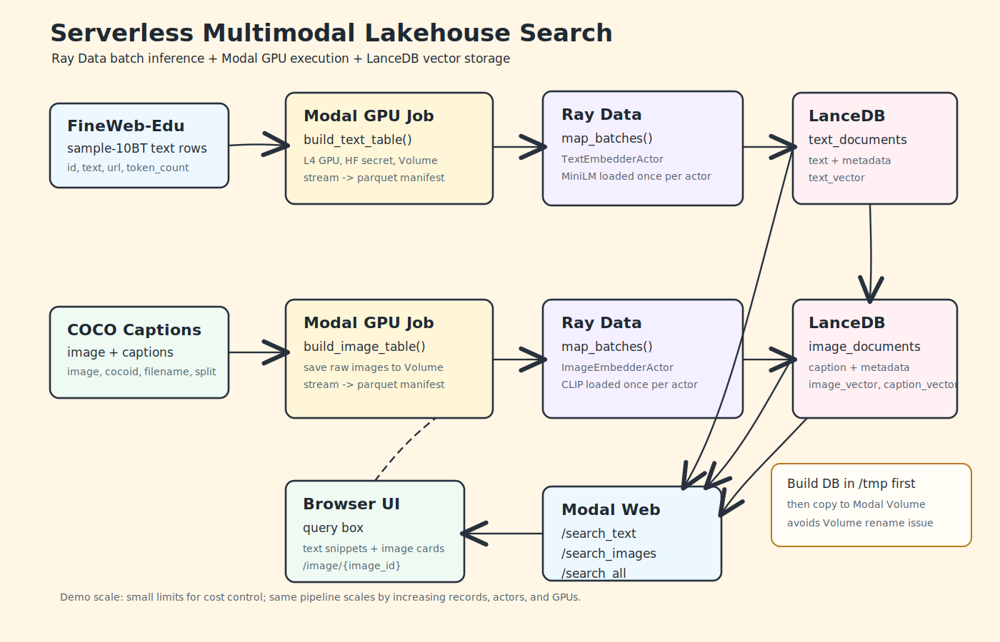

# Serverless Multimodal Data Lakehouse

A demo-scale multimodal data lakehouse built with Ray Data, Modal, LanceDB, and Hugging Face datasets.

The project started as a semantic search demo for FineWeb-Edu text and COCO images. It now extends that spine into a 12-component training-data pipeline: ingestion, content-addressed storage, preprocessing, quality gates, embedding caches, cataloging, dataset versioning, WebDataset-style materialization, loader benchmarking, evaluation feedback, hybrid precompute decisions, and provenance.

This is intentionally not a production data lake. It is a portfolio/interview project that shows the engineering pattern behind distributed AI data pipelines without requiring full web-scale data or a permanent GPU cluster.

## Architecture



Detailed diagrams:

- [Mermaid architecture](MULTIMODAL_TRAINING_DATA_ARCHITECTURE.md)
- [Excalidraw architecture](assets/multimodal-training-data-pipeline.excalidraw)
- [Ray preprocessing scaling notes](docs/RAY_PREPROCESSING_SCALING.md)

The expanded pipeline has 12 components:

| # | Component | Purpose |
| ---: | --- | --- |
| 1 | Source Connectors | Ingest FineWeb-Edu text, COCO images, FineVideo mp4-backed video clips, and LibriSpeech audio from Hugging Face. |
| 2 | Content-Addressed Store | Store raw assets by SHA256 hash using a two-level prefix layout. |
| 3 | Preprocessing Engine | Run Ray Data `map_batches` with stateful actors per modality. |
| 4 | Quality / Dedup / Safety | Apply exact hash dedup, rule checks, FAISS ANN near-dedup, and safety classifiers. |
| 5 | Embedding Service | Precompute and cache embeddings keyed by content hash with model version stamping. |
| 6 | Metadata Catalog | Keep vectors and rich metadata in LanceDB tables. |
| 7 | Dataset Versioning | Write immutable JSON manifests that reference CAS hashes and transform specs. |
| 8 | Materialization | Pack version manifests into WebDataset tar shards for sequential streaming. |
| 9 | Training Loader | Stream shards with prefetch, deterministic shuffle, and mid-epoch resume. |
| 10 | Eval & Feedback Loop | Pin dataset versions, run evals, compare metrics, and generate datasheets. |
| 11 | Precompute vs On-the-Fly | Precompute deterministic transforms and leave cheap augmentations in the loader. |
| 12 | Provenance / Observability | Track per-item license, source chain, OpenLineage events, and dashboard metrics. |

Demo scale target: `10K` records, roughly `$0.15` total GPU cost.

## Data Sources

| Modality | Dataset | Model path |
| --- | --- | --- |
| Text | FineWeb-Edu sample | `sentence-transformers/all-MiniLM-L6-v2` |
| Image | COCO captions | `openai/clip-vit-base-patch32` |
| Video | FineVideo | CLIP keyframe embeddings |
| Audio | LibriSpeech | Whisper encoder features, projected for retrieval/training metadata |

## Repository Layout

```text
distributed-embedding-search-lakehouse/
├── modal_app.py                         # Modal GPU jobs, search endpoints, browser UI
├── src/
│   ├── cas.py                           # Content-addressed storage
│   ├── catalog.py                       # LanceDB metadata catalog
│   ├── connectors/                      # Hugging Face source connectors
│   ├── preprocessing/                   # Ray Data actor preprocessors
│   ├── quality.py                       # Rule-based quality gates
│   ├── dedup.py                         # FAISS near-duplicate filtering
│   ├── embedding_service.py             # Embedding cache service
│   ├── versioning.py                    # Immutable dataset manifests
│   ├── sharding.py                      # WebDataset-style tar materialization
│   └── loader_benchmark.py              # Streaming shard benchmark
├── scripts/
│   ├── 000_run_connectors.py
│   ├── 001_run_preprocessing.py
│   ├── 002_filter_and_dedup.py
│   ├── 003_build_catalog.py
│   ├── 004_create_version.py
│   ├── 005_materialize_shards.py
│   ├── 006_loader_benchmark.py
│   ├── 007_compare_versions.py
│   ├── 008_precompute_assets.py
│   └── 009_tag_licenses.py
├── static/index.html                    # Modal-hosted search UI
├── assets/
└── data/                                # Local generated artifacts, ignored in normal use
```

## Setup

Use Python 3.11. The project supports both `uv pip install -r requirements.txt` and the newer `uv add` / `pyproject.toml` workflow.

```bash
uv venv --python 3.11 --prompt distributed-embedding-search-lakehouse --seed
source .venv/bin/activate
uv pip install --python .venv/bin/python -r requirements.txt
```

If `uv venv` picks a Conda interpreter and editor IntelliSense gets confused, deactivate Conda first:

```bash
conda deactivate
uv venv --python 3.11 --prompt distributed-embedding-search-lakehouse --seed
```

For FAISS, install `faiss-cpu`, not `faiss`. The import name in Python is still `faiss`:

```bash
uv add faiss-cpu torch transformers soundfile librosa
uv run python -c "import faiss, torch, transformers, soundfile, librosa; print('ok')"
```

## Local Search Demo

These scripts exercise the original text and image semantic search pipeline locally:

```bash
python scripts/01_make_sample.py
python scripts/02_local_lancedb_text_smoke_test.py
python scripts/03_local_ray_text_embed.py
python scripts/04_local_ray_text_search.py

python scripts/05_make_coco_sample.py
python scripts/06_local_lancedb_image_smoke_test.py
python scripts/07_local_ray_image_embed.py
python scripts/08_local_ray_image_search.py
```

Expected outputs include local parquet samples, LanceDB tables under `data/`, and metrics JSON files.

## Training Data Pipeline

The newer 12-component pipeline is organized as a numbered runbook:

```bash
python scripts/000_run_connectors.py
python scripts/001_run_preprocessing.py
python scripts/002_filter_and_dedup.py
python scripts/003_build_catalog.py
python scripts/004_create_version.py
python scripts/005_materialize_shards.py
python scripts/006_loader_benchmark.py
python scripts/007_compare_versions.py
python scripts/008_precompute_assets.py
python scripts/009_tag_licenses.py
```

This layer is still being wired into the proven text/image demo. Some components are scaffolding for the final architecture, especially the video/audio paths, safety classifiers, version comparison, and observability hooks.

## Modal GPU Run

Authenticate Modal:

```bash
modal token new
modal profile current
```

Create the Hugging Face secret used by Modal functions:

```bash
modal secret create hf-token HF_TOKEN=your_hf_token_here
```

Run health checks and batch jobs:

```bash
modal run modal_app.py
```

Run the full multimodal pipeline:

```bash
modal run modal_pipeline.py
```

If a long run fails or is cancelled, resume the missing part instead of
restarting everything. Connector and preprocessing stages skip completed
artifacts by default and rebuild incomplete preprocessing outputs when row
counts do not match the source manifest.

```bash
# Re-run only video ingestion.
modal run modal_pipeline.py::resume --stage connector --modality video --video-limit 2000

# Re-run only one preprocessing modality.
modal run modal_pipeline.py::resume --stage preprocess --modality video
modal run modal_pipeline.py::resume --stage preprocess --modality audio

# Continue downstream stages after all modalities are ready.
modal run modal_pipeline.py::resume --stage quality
modal run modal_pipeline.py::resume --stage catalog
modal run modal_pipeline.py::resume --stage versioning
modal run modal_pipeline.py::resume --stage sharding
modal run modal_pipeline.py::resume --stage benchmark
```

Quality/dedup can also resume one modality at a time:

```bash
modal run modal_pipeline.py::resume --stage quality --modality image
modal run modal_pipeline.py::resume --stage quality --modality video
modal run modal_pipeline.py::resume --stage quality --modality text
modal run modal_pipeline.py::resume --stage quality --modality audio
```

Use `--force` when you intentionally want to overwrite a completed artifact:

```bash
modal run modal_pipeline.py::resume --stage preprocess --modality video --force
```

Do not use `--limit 0` as a resume strategy. The connector writes manifests, so
a zero limit can overwrite a valid manifest with an empty one.

The Modal app keeps serving and orchestration in one deployment surface while
leaving reusable pipeline logic in `src/` and `scripts/`. The expanded pipeline
entry points are:

| Modal function | Pipeline stage |
| --- | --- |
| `run_connectors` | Source connectors and CAS ingestion |
| `run_preprocessing` | Ray Data preprocessing actors |
| `run_quality_dedup` | Quality gates and FAISS near-dedup |
| `build_catalog` | LanceDB metadata catalog |
| `create_dataset_version` | Immutable dataset manifest |
| `materialize_shards` | WebDataset-style tar shards |
| `benchmark_loader` | Streaming loader benchmark |
| `compare_dataset_versions` | Version comparison |
| `precompute_assets` | Deterministic precompute stage |
| `tag_licenses` | License/source tagging |
| `pipeline_status` | Modal Volume artifact status |

Serve during development:

```bash
modal serve modal_app.py
```

Deploy persistent endpoints and the browser UI:

```bash
modal deploy modal_app.py
```

The deployed app exposes:

| Endpoint | Purpose |
| --- | --- |
| `/search_text` | Query FineWeb-Edu text vectors. |
| `/search_images` | Query COCO image vectors with text. |
| `/search_all` | Search text and image tables from one request. |
| `/api/search_all` | Browser UI API wrapper. |
| `/api/pipeline_status` | Browser UI pipeline artifact status. |
| `/image/{image_id}` | Serve persisted demo images from Modal Volume. |

Example request:

```bash
curl -X POST "YOUR_SEARCH_ALL_URL" \
  -H "Content-Type: application/json" \
  -d '{"query": "children playing outside", "k": 3}'
```

Good demo queries:

```text
a woman cutting a cake
children playing outside
people riding horses
```

Text and image results are intentionally returned as separate ranked lists because MiniLM and CLIP distances are not directly calibrated.

## Current Metrics

| Run | Records | GPU | Ray actors | Batch size | Runtime | Records/sec | Observed cost |
| --- | ---: | --- | ---: | ---: | ---: | ---: | ---: |
| Modal image batch | 100 | L4 | 1 | 32 | 21.84 sec | 4.58 | - |
| Modal text batch | 500 | L4 | 1 | 128 | 16.48 sec | 30.34 | - |
| Modal image scale check | 250 | L4 | 1 | 32 | 21.95 sec | 11.39 | - |
| Modal text scale check | 1,000 | L4 | 1 | 128 | 19.78 sec | 50.55 | - |
| Modal image demo run | 1,000 | L4 | 1 | 32 | 33.08 sec | 30.23 | - |
| Modal text demo run | 5,000 | L4 | 1 | 128 | 21.59 sec | 231.58 | - |
| Modal image strong run | 2,500 | L4 | 1 | 32 | 39.80 sec | 62.82 | ~$0.04 |
| Modal text strong run | 10,000 | L4 | 1 | 128 | 28.49 sec | 351.06 | ~$0.02 |
| Modal image portfolio run | 5,000 | L4 | 1 | 32 | 72.10 sec | 69.34 | - |
| Modal text portfolio run | 25,000 | L4 | 1 | 128 | 52.89 sec | 472.71 | - |

The larger runs show why tiny smoke-test metrics can be misleading: fixed costs like model loading, Ray startup, dataset setup, and Volume writes are amortized over more records.

## Design Notes

- Ray Data is included to preserve the production shape: partitioned reads, `map_batches`, and actors that load models once per worker.
- Modal provides serverless GPU execution without managing EC2, Kubernetes, or a persistent Ray cluster.
- LanceDB stores vectors and metadata together, which fits a lakehouse-style retrieval workflow.
- CAS and immutable manifests make dataset versions reproducible without copying large assets.
- WebDataset-style shards turn many small files into sequential reads that training workers can stream efficiently.
- The browser UI serves images through `/image/{image_id}` because `/data/...` paths are internal Modal Volume paths, not public URLs.

## Known Limitations

- Indexed datasets are intentionally small, so search quality is sample-limited.
- The 12-component training-data layer is partly scaffolded and still needs end-to-end hardening.
- Video and audio paths are included architecturally, but the strongest tested path remains text plus image.
- Safety classifiers, OpenLineage events, Grafana dashboards, and datasheet generation are design targets rather than fully implemented production services.
- There is no authentication, authorization, rate limiting, retry queue, or production observability.
- Modal endpoint cold starts can be slow because embedding models load inside endpoint containers.

## References

- [Ray Data](https://docs.ray.io/en/latest/data/data.html)
- [Modal](https://modal.com/docs)
- [LanceDB](https://docs.lancedb.com/)
- [FineWeb-Edu](https://huggingface.co/datasets/HuggingFaceFW/fineweb-edu)
- [COCO Image Captioning dataset](https://huggingface.co/datasets/MagiBoss/COCO-Image-Captioning)
- [WebDataset](https://github.com/webdataset/webdataset)
