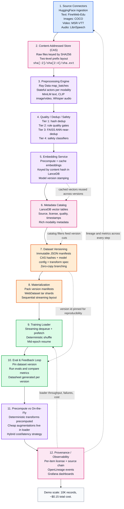

# Multimodal Training Data Pipeline Architecture

```mermaid
flowchart TD
    A["1. Source Connectors<br/>HuggingFace ingestion<br/>Text: FineWeb-Edu<br/>Images: COCO<br/>Video: MSR-VTT<br/>Audio: LibriSpeech"]
    B["2. Content-Addressed Store (CAS)<br/>Raw files keyed by SHA256<br/>Two-level prefix layout<br/><code>sha[:2]/sha[2:4]/sha.ext</code>"]
    C["3. Preprocessing Engine<br/>Ray Data map_batches<br/>Stateful actors per modality<br/>MiniLM text, CLIP image/video, Whisper audio"]
    D["4. Quality / Dedup / Safety<br/>Tier 1: hash dedup<br/>Tier 2: rule quality gates<br/>Tier 3: FAISS ANN near-dedup<br/>Tier 4: safety classifiers"]
    E["5. Embedding Service<br/>Precompute + cache embeddings<br/>Keyed by content hash in LanceDB<br/>Model version stamping"]
    F["6. Metadata Catalog<br/>LanceDB vector tables<br/>Source, license, quality, timestamps<br/>Rich modality metadata"]
    G["7. Dataset Versioning<br/>Immutable JSON manifests<br/>CAS hashes + model config + transform spec<br/>Zero-copy branching"]
    H["8. Materialization<br/>Pack version manifests<br/>WebDataset tar shards<br/>Sequential streaming layout"]
    I["9. Training Loader<br/>Streaming dequeue + prefetch<br/>Deterministic shuffle<br/>Mid-epoch resume"]
    J["10. Eval & Feedback Loop<br/>Pin dataset version<br/>Run evals and compare metrics<br/>Datasheet generated per version"]
    K["11. Precompute vs On-the-Fly<br/>Deterministic transforms precomputed<br/>Cheap augmentations live in loader<br/>Hybrid cost/latency strategy"]
    L["12. Provenance / Observability<br/>Per-item license + source chain<br/>OpenLineage events<br/>Grafana dashboards"]

    A --> B --> C --> D --> E --> F --> G --> H --> I --> J --> K --> L

    F -. "catalog filters feed version cuts" .-> G
    E -. "cached vectors reused across versions" .-> F
    G -. "version id pinned for reproducibility" .-> J
    L -. "lineage and metrics across every step" .-> A
    L -. "loader throughput, failures, cost" .-> I

    N["Demo scale: 10K records, ~$0.15 total cost."]
    L --> N

    classDef ingestion fill:#DBEAFE,stroke:#2563EB,color:#0F172A,stroke-width:2px;
    classDef processing fill:#F3E8FF,stroke:#7C3AED,color:#0F172A,stroke-width:2px;
    classDef storage fill:#FCE7F3,stroke:#DB2777,color:#0F172A,stroke-width:2px;
    classDef versioning fill:#FFEDD5,stroke:#EA580C,color:#0F172A,stroke-width:2px;
    classDef training fill:#DCFCE7,stroke:#16A34A,color:#0F172A,stroke-width:2px;
    classDef note fill:#F8FAFC,stroke:#64748B,color:#0F172A,stroke-width:1px;

    class A ingestion;
    class C,D,E,K processing;
    class B,F,L storage;
    class G,H versioning;
    class I,J training;
    class N note;
```

